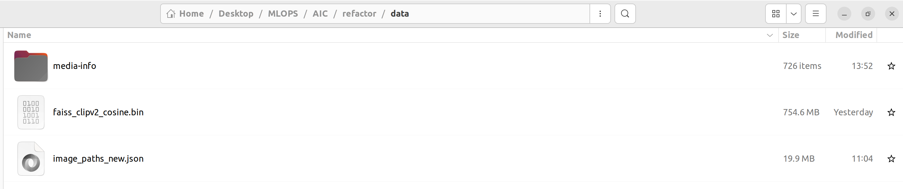
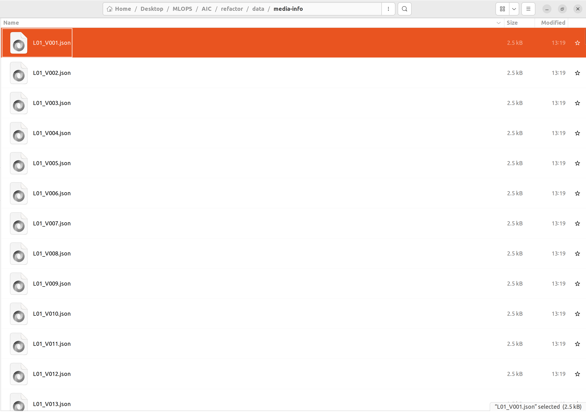

## Prerequisites

- Python 3.10+
- conda
- npm (see https://nodejs.org/en/download/package-manager )

## Installation

1. Clone the repository:
   ```bash
   git clone https://github.com/dinhln03/refactor.git
   cd refactor
   ```

2. Create a virtual environment (optional but recommended):
   ```bash
   conda create -n aic python=3.10 
   conda activate aic
   pip install -r requirements.txt
   ```

3. Import media-info, bin file and ison file into data dir
   
    Make sure that content of files look like this:
    - media-info
    
    - json
    

4. Run backend
   ```bash
   python app.py
   ```

5. Run frontend
   ```bash
   cd image-search-ui
   npm install
   npm start
   ```
